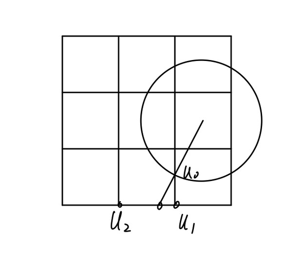
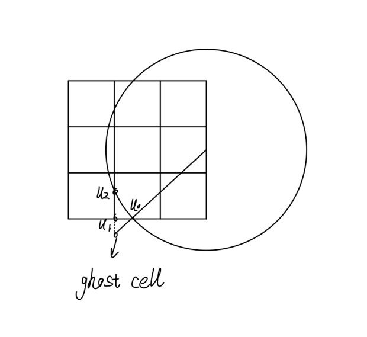

# 文件与设计说明

## 1 文档说明

+ `bin` 目录下是生成的可执行文件.
+ `include` 目录下是所有的头文件声明及实现.
  + `json.hpp` 是一个header-only的C++ json解释包，项目地址为：https://github.com/nlohmann/json
  + `domin.hpp` 声明了定义域的枚举类.
  + `innerpoint.hpp` 为网格上的格点定义了类.
  + `disk.hpp` 定义了圆盘类.
  + `boundcondi.hpp` 定义了边值条件类.
  + `BVP.hpp` 定义了网格类，并实现了BVP求解器.
+ `output` 目录下是输出：
  + `convergence.txt` 是主程序输出的1-norm, 2-norm, $\infty$-norm的报告.
  + `plot.txt` 是按照matlab格式以便绘图的格式化输出，其中我只选择绘制了不规则定义域上(三种不同的圆)的三个函数的图像.
  + `image` 目录下是绘制的图像.
  + `matplot` 目录下是matlab源码.
+ `report` 目录下是报告文档.
+ `src` 目录下是主程序：
  + `main.cpp` 是设计的三种函数，并采用不同的边值条件进行测试与输出，输出在`output/convergence.txt`.
  + `plot.cpp` 是绘图所用的格式化输出程序，输出在`output/plot.txt`.
  + `boundaryCondi` 目录下是三个json文件，表示边值类型和条件，分别测试了Dirichlet,Neumann和Mixed边值条件.
+ `test` 目录下是测试文件：
  + `catch.hpp` 是一个header-only的C++单元测试框架，项目地址为：https://github.com/catchorg/Catch2

## 2 编译与运行

代码作者的本地具有以下软件与环境：

+ Ubuntu 18.04

+ g++(GCC) 11.2.0 (C++20) 

  因为使用了`<optional>`，请使用**版本在 7.1(C++17) 及以上的g++(GCC)**编译.

+ Lapack 3.10.0

+ GNU Make 4.1

编译：

+ 输入`make` 生成主程序部分的可执行文件.
+ 输入`make test` 执行测试.
+ 输入`make clean` 清除生成的可执行文件.

运行：

+ 输入`make run` 将可执行程序的输出定向到指定文件.

## 3 设计说明

### 3.1 类设计

+ 构造了innerpoint类用于存储每个待求值的点的信息. 
+ 构造了BoundaryCondi类用于记录边值条件并作为BVP_solver的参数.
+ 构造grid类，内含innerpoints的vector作为成员变量. 同时在类里实现BVP_solver函数. 通过模板特化将规则与不规则定义域的情况分离开.

### 3.2 实现思路

+ 对于规则的定义域，从下向上逐个遍历每个点，并把该点处的表达式推导出来，列进方程组即可。在边界处的点的表达式我选择了ghost cell方法推导二阶准确表达式。

+ 对于不规则的定义域，由于圆盘位置的不确定性，使用之前的遍历方式固然不行，于是改变思路，首先声明一系列函数用于获取当前点的前后左右四个点，

  ```cpp
  innerpoint left_pnt(double x, double y)const;
  ```

  这样，每遍历一个格点，就检查它的四个邻点是否在vector里，不在则把它添加进去。并且我在innerpoint类里定义了一系列标签用于记录点的位置信息，以便后续推导表达式时更方便，

  ```cpp
  enum positionType{
      corner     = 0, // points on the corner
      leftbound  = 1, // points on the left boundary
      rightbound = 2, // points on the right boundary
      upbound    = 3, // points on the upper boundary
      downbound  = 4, // points on the lower boundary
      ondisk     = 5, // points on the disk's boundary
      insquare   = 6, // points inside the square
      offsquare  = 7, // points off the square
      onXaxis    = 8, // points on a line paralleled to X-axis,
     								  // with the line being part of the grid.
      onYaxis    = 9, // points on a line paralleled to Y-axis
      							  // with the line being part of the grid.
      unknown    = 10
  };
  ```

  当圆上的边值条件是Neumann时，对于圆上的点，我采用以下方法推导一阶准确表达式：

  

  即过圆心连接两点并延伸，找与网格的交点，用该交点周边两点做插值来推导相应表达式。如果延伸线与网格的交点在定义域$[0,1]^2$外，

  

  ​	通过延伸网格线，找到交点作为ghost cell，然后选取ghost cell附近的两个点，插值推导表达式。

+ json文件格式说明：

  + "BoundaryOfSquare"代表方形区域边界上的边值条件，"BoundaryOfDisk"代表圆上的边值条件.
  
  + "BoundaryType"代表边值类型，"CoeffiOfNeum"和"CoeffiOfDirch"分别表示Mixed边值条件
    $$
     a\frac{\partial U}{\partial \vec{n}}+bU=g(x,y)
    $$
    中的系数$a$和$b$.
  
  + "ValueAt00"表示函数在$(0,0)$点的值，如果所有边界条件都是Neumann的话，解是不唯一的，此时需要给定一个点处的值。
  
+ json文件的使用：

  可以通过使用lambda表达式来获取Mixed边值条件的函数表达

  ```cpp
  auto left_mixed = [](double a, double b){
      return [a,b](double x, double y){
          return -cos(x)*exp(y+sin(x))*a + exp(y+sin(x))*b;
      };
  };
  ```

## 4 程序报告

见[report/report.pdf](./report/report.pdf).

