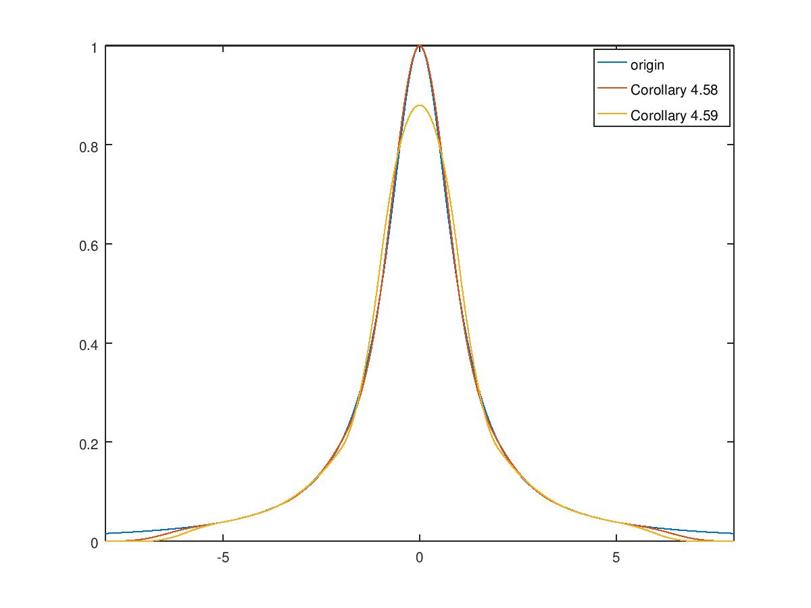

# 测试文件说明

测试文件分四个部分

+ 第一部分是测试多项式的相关功能

  + ```cpp
    Polynomial<3,int> poly{1,2,3,4};
    cout << poly(1) << endl;
    Polynomial<3,double> p2;
    p2 = poly;
    Polynomial<2,double> p3{5,7,9};
    ```

    这段测试基本的构造和拷贝构造。

  + ```cpp
    auto pp = p2 + poly;
    auto pp2 = p2 - p3;
    ```

    这里测试多项式的加减法

  + ……其余的测试可见于代码里的注释

+ 第二部分是测试一维的`interpolate`函数

  + ```cpp
    auto RES = interpolate<4>(inter,complete);
    auto RES2 = interpolate<4>(inter,notAknot);
    auto RES3 = interpolate<4>(inter,periodic);
    cout << RES << RES2 << RES3 ;
    ```

    分别测试不同边界条件的情况。经验证，生成的样条都是正确的。

+ 第三部分是测试二维的`fitCurve`函数

  + ```cpp
    vector<Vec<double,2>> lst{{1,1},{4,5},{10,13},{1,1},{1,1}};
    auto RES5 = fitCurve<4>(lst,complete);
    cout << RES5;
    cout << RES5.spline[0](5) <<" " << RES5.spline[1](5)<< endl;
    ```

    这段测试order=4的complete情形

  + ```cpp
    vector<Vec<double,2>> lst2{{1,1},{7,9},{4,5},{9,17}};
    auto RES6 = fitCurve<4>(lst2,notAknot);
    cout << RES6;
    ```

    这段测试order=4的notAknot情形

  + ```cpp
    auto RES7 = fitCurve<4>(lst2,periodic);
    cout << RES7;
    ```

    这段测试order=4的periodic情形

  + ```cpp
    auto RES8 = fitCurve<2>(lst2,complete);
    cout << RES8;
    ```

    这段测试order=2的情形

+ 第四部分测试cardinalB样条的`interpolate`函数

  + ```cpp
    double _a[11] = {-5,-4,-3,-2,-1,0,1,2,3,4,5};
    int _b[11] = {2,1,1,1,1,1,1,1,1,1,2};
    InterpConditions _interp(11,_a,_b,_func);
    auto RRRES = interpolate<3>(_interp);
    cout << RRRES;
    ```

    这段测试Corollary 4.58

  + ```cpp
    #define f _func[0]
    double _a_[10] = {-5,-4,-3,-2,-1,0,1,2,3,4};
    int _b_[10] = {2,1,1,1,1,1,1,1,1,2};
    double _c[12] = {f(-4.5),f(-5),f(-3.5),f(-2.5),f(-1.5),
                     f(-0.5),f(0.5),f(1.5),f(2.5),f(3.5),f(4.5),f(5)};
    InterpConditions _interp2(10,_a_,_b_,_c);
    auto RRES2 = interpolate<2>(_interp2);
    cout << RRES2;
    #undef f
    ```

    这段测试Corollary 4.59

  + 上述两个测试生成的图像如下：

    

